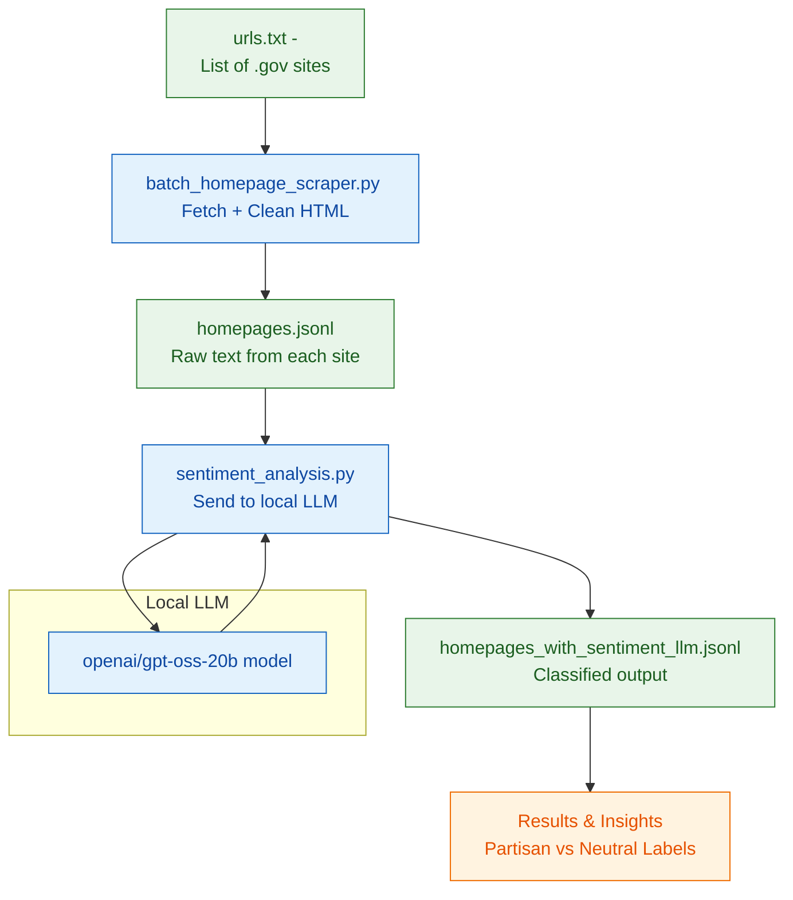

## Sentiment Index

A tool for collecting and analyzing text from U.S. federal government websites.  
It scrapes each site's homepage, extracts visible text, and uses a local LLM to detect partisan or accusatory language.

### Workflow

### What's working
* Scrape .gov sites from a manual list
* send data to an LLM and get back data
* plot output in a jupyter notebook

### What needs work
* detect when .gov list is updated
* periodic job scraping data
* script to create url list from .gov csv
* test DMR or other method to run multiple instances of an LLM
* hand verify one instance of partisan/neutral for regression tests
* check "unknown" with http status code 200 to verify site doesnt work/return 
* regression testing (pytest?) to test LLMs against each other
* sentimentor repeatability, if i run it 10x do i get the same results? deterministic?
* check sentimentor without truncate options
* if i have a lot of datasets, is it worth sagemaker/mturk ?
* add timestamps / total time to collect and sentiment runs
* processor and code logging, grafana
* vars or flags for sentimentor's model name, in/out files
* database results instead of json files
* setup a queue to run data through LLMs